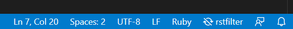
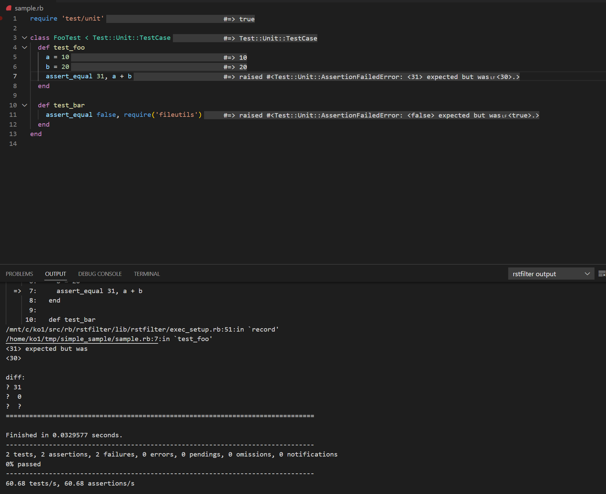
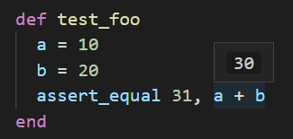

# vscode-rstfilter README

You can see the execution results by saving the file.

## Requirements

`rstfilter-lsp` command in `rstfilter` gem is needed.

```
$ gem install rstfilter
```

## Usage 

1. *Open* .rb file.
2. *Click* the button on the statsus bar to enable rstfilter extension (disabled on default). 

   

3. *Save* .rb file and you can see the results line by line on the editor window on the editor and output in the OUTPUT window at bottom.

   

   Note that rstfilter extension *runs the script* at save timing. You can kill a running process by disabling rstfilter extension by clicking the button on the status bar.

4. *Hover* your mouse pointer on the expression in the editor window and you can see the results.

   

5. *Edit* the script and all results are removed.

## Extension Settings

* Rstfilter Lsp Path: Path to rstfilter-lsp (gem rstfilter for install).
* Enable On Default: Enable rstfilter extension on load.

## Advise

Traditional idiom using `$0` will help to use this extension.

```ruby
class XXX
  # ...
end

if $0 == __FILE__
  # Try XXX here.
  # This code doesn't work when this file is required.
end
```
