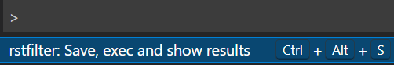
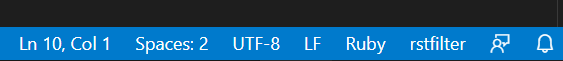
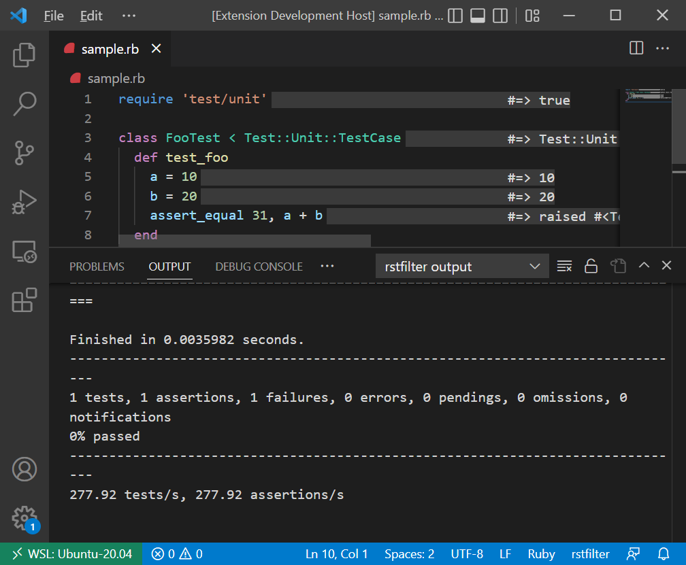
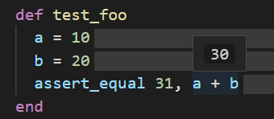

# vscode-rstfilter README

You can see the execution results by saving the file.

## Requirements

`rstfilter-lsp` command in latest `rstfilter` gem is needed.

```
$ gem install rstfilter
```

## Usage 

1. *Open* `.rb` file and *edit* the script.
2. *Start* rstfilter using one of the following three methods:
   * Use shortcut `Ctrl+Alt+S`. (recommended)
   * Use command "rstfilter: Save, exec and show results".

     

   * Click "rstfilter" status bar.

     

3. *Confirm* the execution results on source code and the output.

   

4. *Hover* your mouse pointer on the expression in the editor window and you can see the results.

   

5. *Edit* the script and all results are removed.

If your program halts, click the rstfilter status bar and the Ruby process will be killed.

## Commands

* `ruby-rstfilter.save_exec_and_show`: Start rstfilter.
* `ruby-rstfilter.restart`: Restart rstfilter language server. If a Ruby process is running by rstfilter, kill the Ruby process.

## Extension Settings

* Rstfilter Lsp Path: Path to rstfilter-lsp (gem rstfilter for install).
* Enable On Default: Enable rstfilter extension on load.

## Advise

### Writing library tips

Traditional idiom using `$0` will help to use this extension.

```ruby
class MyLib
  # ...
end

if $0 == __FILE__
  # Try MyLib here.
  # This code doesn't work when this file is required.
end
```

